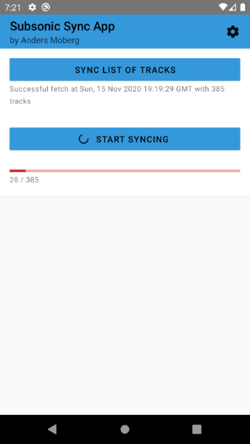

# MySubsonicSyncApp

> **Note**
>
> I'm archiving this project after one last patch to suit my personal needs. If I were to return to a similar app, I'm considering redoing the entire app from scratch, not in React Native.

React Native app for mobile, meant for use with Subsonic servers.

Performs download syncing of music from your Subsonic server to your Android device. It queries your server for music that meets certain criteria and then downloads them to your phone on command.

Why an app like this:

- Circumvents the need for the Subsonic server to have auto-playlists implemented.
- Mitigates the need for using a Subsonic-compatible music player.
- Support me developing a free time project and learning about React Native. ☺️

Currently the app is in a functioning prototype phase. Pretty bare and a bit messy code-wise but functioning for my personal needs.

To-do:

- [x]  Settings page where users **select server url, user** and **password.**
- [x]  **Password salting**.
- [x]  **Ping** to server lets user manually test connection to server. Used for error handling
- [x]  Songs synced to your device are **starred tracks, or tracks within starred albums**
- [x]  App creates a folder within your ”Music” folder, which is used for sync
- [ ]  Allow user to decide location where music is synced to
- [ ]  Allow user to cancel the download-sync process
- [ ]  Show data for currently downloaded song whilst download-sync is active
- [ ]  Investigate and allow user to define query for tracks that should be synced
- [ ]  Implement sync engine (optimize data-storage, manage tracks that have been removed from query since last time)
- [ ]  CRON jobs (allow app to sync music automatically during certain times of the day)
- [ ]  Progress bar notification (would need to implement this React native component myself)
- [ ]  Allow user to define codec to use in app
- [ ]  Investigate possibility for iOS-compability
- [ ]  Investigate possibility for hosting on Android app stores (Play Store, F-Droid)
- [ ]  Investigate software licenses
